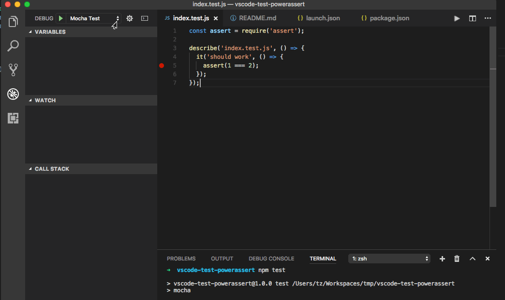

## vscode bug report for interaction with power-assert

Step:

1. setBreakpoint at `assert` statement at `index.test.js`
2. launch `Mocha Test without power-assert` everything is ok.
3. launch `Mocha Test`, the breakpoint is move to the first line.
  - it will use [power-assert](https://github.com/power-assert-js/power-assert) to assert.
  - which will use [intelli-espower-loader](https://github.com/power-assert-js/intelli-espower-loader) to transform the test file.



`package.json`:

```json
{
  "name": "vscode-test-powerassert",
  "version": "1.0.0",
  "description": "",
  "main": "index.js",
  "scripts": {
    "test": "mocha --require intelli-espower-loader --inspect-brk",
    "test2": "mocha --inspect-brk"
  },
  "keywords": [],
  "author": "TZ <atian25@qq.com>",
  "license": "MIT",
  "dependencies": {
    "intelli-espower-loader": "^1.0.1",
    "mocha": "^4.0.1",
    "power-assert": "^1.4.4"
  }
}
```

`launch.json`:

```json
{
  // Use IntelliSense to learn about possible attributes.
  // Hover to view descriptions of existing attributes.
  // For more information, visit: https://go.microsoft.com/fwlink/?linkid=830387
  "version": "0.2.0",
  "configurations": [
    {
      "type": "node",
      "request": "launch",
      "name": "Mocha Test",
      "runtimeExecutable": "npm",
      "runtimeArgs": [
        "run-script",
        "test"
      ],
      "port": 9229
    },
    {
      "type": "node",
      "request": "launch",
      "name": "Mocha Test with power-assert",
      "runtimeExecutable": "npm",
      "runtimeArgs": [
        "run-script",
        "test2"
      ],
      "port": 9229
    }
  ]
}
```